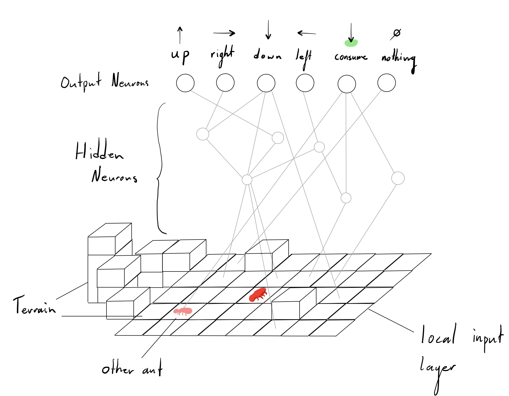
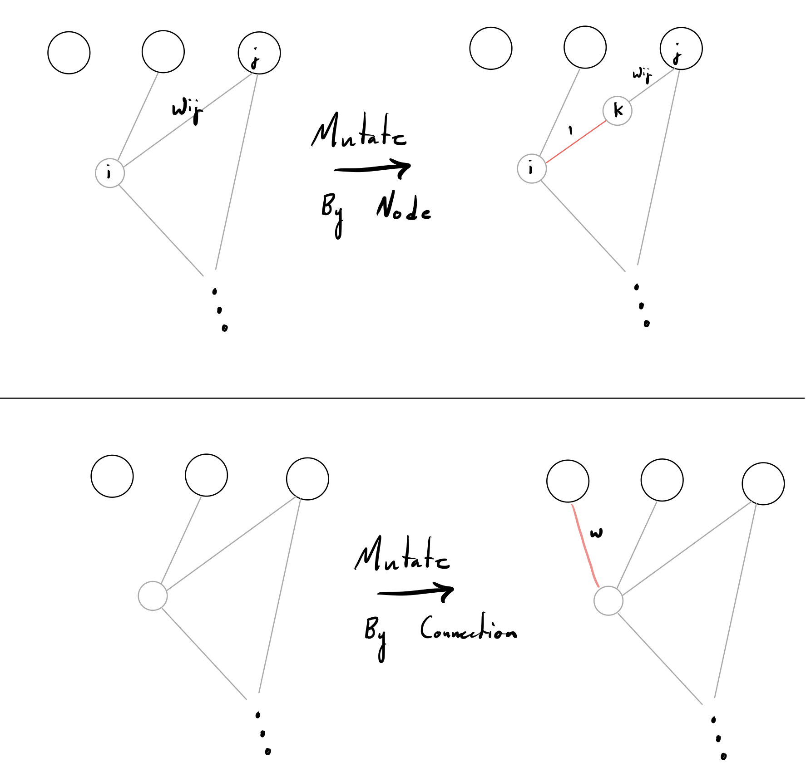

# Assignment 3: Antymology

## Introduction
I have implemented an Evolutionary Algorithm as required to solve a colony optimization problem. The outcome being maximized is nest blocks produced by the queen during its lifetime. The constraints are the described behaviour of the agents outlined in the assignment description.

The unit of evolution here is the object **Colony**, which consists of 20 **Ants** and one **QueenAnt**. Below is a freshly spawned colony:

Each **Ant** and **QueenAnt** holds its own *NervousSystem*, a structure which senses its surroundings and produces an output on each time step. This 

The input for the all ants *NervousSystem* is a 9 by 9 square around its local position, where it sits in the centre. Each node takes on the global pheromone deposit. A location (square) will have high pheromone concetrations if an ant has been recently there.

Each Nervous System will by modified through evolution to produce emergent behaviour. The way which this has been accomplished is through the following seminal paper:

Stanley, Kenneth O & Miikkulainen, Risto, 2002. Evolving Neural Networks through Augmenting Topologies. *Evolutionary computation*, 10(2), pp.99–127.

The approach to 'Augment Topologies' means to start with no hidden neurons or connections, and incrementally mutate by adding nodes or connections.

These two fundamental genetic operators can be sequentially applied to the *NervousSystem* of each ant. Over many generations the aim is for the Colony to search for each of its ants *NervousSystem*'s that maximize the nest block produciton of the queen. 

## Saving with Deserialization and Serialization
In order to verify and reuse the top performing colony in the evolutionary search, it must be saved to the disk for permanent storage beyond the game in Unity. C# provides the ability to Serialize class graphs which only contain primitive data types as attributes. I then Serialized only the *NervousSystem* class and then attached them to monobehaviours on load.

## How to observethe Top Colony
To load the top performing colony from attempt 2, the WorldManager object in the scene contains a checkbox for Load Top Colony. If this is checked, the best *NervousSystem*'s I found are loaded (deserialized) into a single colony. You can then fly over to where they are spawned and progress time on your command by pressing the **'+'** key on the keypad.

## Evolution Attempts
What I learned and changed:

### Attempt 1
The fitness function was defined as only total nest blocks produced. 4 Colonies were spawned in equal distance apart and on each frame, the Act() function was called on each ant.

The Act() function completes the sensation to motor sequence that any generic nervous system accomplishes. The sense input was prescribed the following values:
            float queenIntensity = 3.5f;
            float otherAntIntensity = 2.25f;
            float mulchIntensity = 1f;
            float elseIntensity = 0f;
            float nestIntensity = -0.25f;
where a location recieved that value if it held a queen, other ant, mulch block, nest block, etc. Given only these values from the input layer the *NervousSystem* was computed, and the max of the six output nodes were taken as a motor decision. 

**Best Fitness** : 13
**Total Generations** : 250

### Attempt 1

## Cooper's Description ------------------------------------

As we\'ve seen in class, ants exhibit very interesting behaviour. From finding the shortest path to building bridges out of bodies ants have evolved to produce complex emergents from very simple rules. For your assignment you will need to create a species of ant which is capable of generating the biggest nest possible.

I have already created the base code you will use for the assignment. Currently the simulation environment is devoid of any dynamic behaviour and exists only as a landscape. You will need to extend the functionality of what I have written in order to produce \"intelligent\" behaviour. Absolutely no behaviour has been added to this project so you are free to implement whatever you want however you want, with only a few stipulations.

## Goal

The only goal you have is to implement some sort of evolutionary algorithm which maximises nest production. You are in complete control over how your ants breed, make choices, and interact with the environment. Because of this, your mark is primarily going to be reflective of how much effort it looks like you put into this vs. how well your agents maximise their fitness (I.e. don\'t worry about having your ants perform exceptionally well).

## Current Code
My code is currently broken into 4 components (found within the components folder)
1. Agents
2. Configuration
3. Terrain
4. UI

You are able to experience it generating an environment by simply running the project once you have loaded it into unity.

### Agents
The agents component is currently empty. This is where you will place most of your code. The component will be responsible for moving ants, digging, making nests, etc. You will need to come up with a system for how ants interact within the world, as well as how you will be maximising their fitness (see ant behaviour).

### Configuration
This is the component responsible for configuring the system. For example, currently there exists a file called ConfigurationManager which holds the values responsible for world generation such as the dimensions of the world, and the seed used in the RNG. As you build parameters into your system, you will need to place your necesarry configuration components in here.

### Terrain
The terrain memory, generation, and display all take place in the terrain component. The main WorldManager is responsible for generating everything.

### UI
This is where all UI components will go. Currently only a fly camera, and a camera-controlled map editor are present here.

## Requirements

### Admin
 - This assignment must be implemented using Unity 2019or above (see appendix)
 - Your code must be maintained in a github (or other similar git environment) repository.
 - You must fork from this repo to start your project.
 - You will be marked for your commit messages as well as the frequency with which you commit. Committing everything at once will receive a letter grade reduction (A →A-).
 - All project documentation should be provided via a Readme.md file found in your repo. Write it as if I was an employer who wanted to see a portfolio of your work. By that I mean write it as if I have no idea what the project is. Describe it in detail. Include images/gifs.

### Interface
- The camera must be usable in play-mode so as to allow the grader the ability to look at what is happening in the scene.
- You must create a basic UI which shows the current number of nest blocks in the world

### Ant Behaviour
- Ants must have some measure of health. When an ants health hits 0, it dies and needs to be removed from the simulation
- Every timestep, you must reduce each ants health by some fixed amount
- Ants can refill their health by consuming Mulch blocks. To consume a mulch block, and ant must be directly ontop of a mulch block. After consuming, the mulch block must be removed from the world.
- Ants cannot consume mulch if another ant is also on the same mulch block
- When moving from one black to another, ants are not allowed to move to a block that is greater than 2 units in height difference
- Ants are able to dig up parts of the world. To dig up some of the world, an ant must be directly ontop of the block. After digging, the block is removed from the map
- Ants cannot dig up a block of type ContainerBlock
- Ants standing on an AcidicBlock will have the rate at which their health decreases multiplied by 2.
- Ants may give some of their health to other ants occupying the same space (must be a zero-sum exchange)
- Among your ants must exists a singular queen ant who is responsible for producing nest blocks
- Producing a single nest block must cost the queen 1/3rd of her maximum health.
- No new ants can be created during each evaluation phase (you are allowed to create as many ants as you need for each new generation though).

## Tips
Initially you should first come up with some mechanism which each ant uses to interact with the environment. For the beginning phases your ants should behave completely randomly, at least until you have gotten it so that your ants don't break the pre-defined behaviour above.

Once you have the interaction mechanism nailed down, begin thinking about how you will get your ants to change over time. One approach might be to use a neural network to dictate ant behaviour

https://youtu.be/zIkBYwdkuTk

another approach might be to use phermone deposits (I\'ve commented how you could achieve this in the code for the AirBlock) and have your genes be what action should be taken for different phermone concentrations, etc.

## Submission
Export your project as a Unity package file. Submit your Unity package file and additional document using the D2L system under the corresponding entry in Assessments/Dropbox. Inlude in the message a link to your git repo where you did your work.
